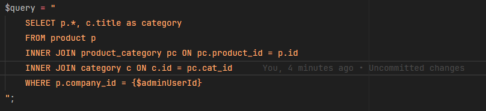
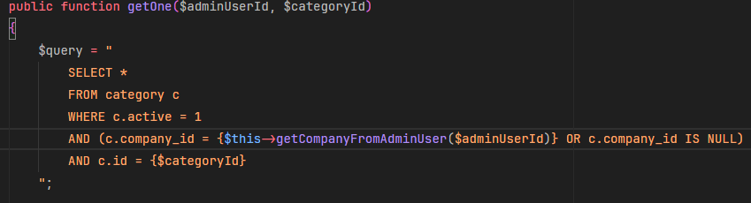
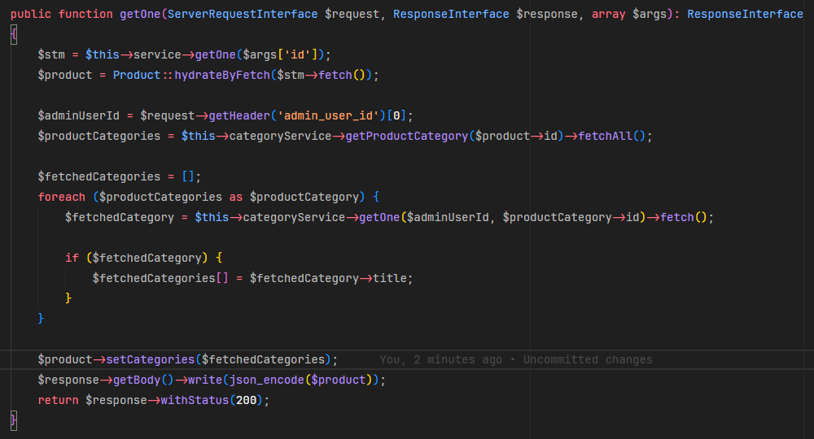
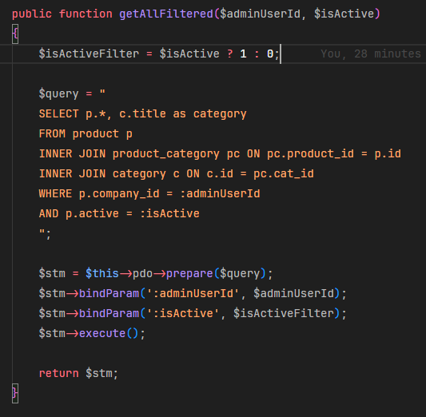
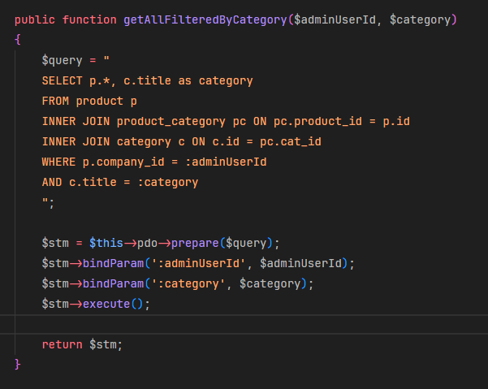

# DESAFIO BACKEND

## Configuração do Ambiente

### Requisitos

- Instalar o _PHP >= 8.0_ e [extensões](https://www.php.net/manual/pt_BR/extensions.php) (**não esquecer de instalar as seguintes extensões: _pdo_, _pdo_sqlite_ e _sqlite3_**);
- Instalar o [_SQLite_](https://www.sqlite.org/index.html);
- Instalar o [_Composer_](https://getcomposer.org/).

### Instalação

- Instalar dependências pelo _composer_ com `composer install` na raiz do projeto;
- Servir a pasta _public_ do projeto através de algum servidor.
  (_Sugestão [PHP Built in Server](https://www.php.net/manual/en/features.commandline.webserver.)_. Exemplo para servir a pasta public: `php -S localhost:8000 -t public`)

## Sobre o Projeto

- O cliente XPTO Ltda. contratou seu serviço para realizar alguns ajustes em seu sistema de cadastro de produtos;
- O sistema permite o cadastro, edição e remoção de _produtos_ e _categorias de produtos_ para uma _empresa_;
- Para que sejam possíveis os cadastros, alterações e remoções é necessário um usuário administrador;
- O sistema possui categorias padrão que pertencem a todas as empresas, bem como categorias personalizadas dedicadas a uma dada empresa. As categorias padrão são: (`clothing`, `phone`, `computer` e `house`) e **devem** aparecer para todas as _empresas_;
- O sistema tem um relatório de dados dedicado ao cliente.

## Sobre a API

As rotas estão divididas em:

- _CRUD_ de _categorias_;
- _CRUD_ de _produtos_;
- Rota de busca de um _relatório_ que retorna um _html_.

E podem ser acessadas através do uso do Insomnia, Postman ou qualquer ferramenta de sua preferência.

**Atenção**, é bem importante que se adicione o _header_ `admin_user_id` com o id do usuário desejado ao acessar as rotas para simular o uso de um usuário no sistema.

A documentação da API se encontra na pasta `docs/api-docs.pdf`

- A documentação assume que a url base é `localhost:8000` mas você pode usar qualquer outra url ao configurar o servidor;
- O _header_ `admin_user_id` na documentação está indicado com valor `1` mas pode ser usado o id de qualquer outro usuário caso deseje (_pesquisando no banco de dados é possível ver os outros id's de usuários_).

Caso opte por usar o [Insomnia](https://insomnia.rest/) o arquivo para importação se encontra em `docs/insomnia-api.json`.
Caso opte por usar o [Postman](https://www.postman.com/) o arquivo para importação se encontra em `docs/postman-api.json`.

## Sobre o Banco de Dados

- O banco de dados é um _sqlite_ simples e já vem com dados preenchidos por padrão no projeto;
- O banco tem um arquivo de backup em `db/db-backup.sqlite` com o estado inicial do projeto caso precise ser "resetado".

## Demandas

Abaixo, as solicitações do cliente:

### Categorias

- [x] A categoria está vindo errada na listagem de produtos para alguns casos
      (_exemplo: produto `blue trouser` está vindo na categoria `phone` e deveria ser `clothing`_);
- [x] Alguns produtos estão vindo com a categoria `null` ao serem pesquisados individualmente (_exemplo: produto `iphone 8`_);
- [x] Cadastrei o produto `king size bed` em mais de uma categoria, mas ele aparece **apenas** na categoria `furniture` na busca individual do produto.

### Filtros e Ordenamento

Para a listagem de produtos:

- [x] Gostaria de poder filtrar os produtos ativos e inativos;
- [ ] Gostaria de poder filtrar os produtos por categoria;
- [ ] Gostaria de poder ordenar os produtos por data de cadastro.

### Relatório

- [ ] O relatório não está mostrando a coluna de logs corretamente, se possível, gostaria de trazer no seguinte formato:
      (Nome do usuário, Tipo de alteração e Data),
      (Nome do usuário, Tipo de alteração e Data),
      (Nome do usuário, Tipo de alteração e Data)
      Exemplo:
      (John Doe, Criação, 01/12/2023 12:50:30),
      (Jane Doe, Atualização, 11/12/2023 13:51:40),
      (Joe Doe, Remoção, 21/12/2023 14:52:50)

### Logs

- [ ] Gostaria de saber qual usuário mudou o preço do produto `iphone 8` por último.

### Extra

- [ ] Aqui fica um desafio extra **opcional**: _criar um ambiente com_ Docker _para a api_.

**Seu trabalho é atender às 7 demandas solicitadas pelo cliente.**

Caso julgue necessário, podem ser adicionadas ou modificadas as rotas da api. Caso altere, por favor, explique o porquê e indique as alterações nesse `README`.

Sinta-se a vontade para refatorar o que achar pertinente, considerando questões como arquitetura, padrões de código, padrões restful, _segurança_ e quaisquer outras boas práticas. Levaremos em conta essas mudanças.

Boa sorte! :)

## Suas Respostas, Duvidas e Observações

A categoria estava vindo errada para alguns produtos devido a um erro na consulta SQL, mais especificamente no inner join entre category e product_category, o join estava sendo feito com o id da tabela product_category ao invés do id da categoria (cat_id).

Alguns produtos estavam sendo retornados com o valor null na categoria na pesquisa por id, isso acontecia porque na tabela category as categorias que são globais(para qualquer empresa), estão sendo definidas como NULL, então na na função getOne do CategoryService.php a consulta SQL estava buscando somente resultados que tivessem um valor definido com company_id. Como achava um null no lugar, as condições não eram cumpridas e o resultado retornado era nulo., para contornar isso eu adicionei a consulta uma condição para que também aceitasse valores NULL na coluna company_id.

Já no terceiro problema eu optei por transformar o atributo category da classe Product em um array para o caso dos produtos que possuem mais de uma categoria e para não mostrar mais de um objeto no retorno da função getOne, o que seria meio incoerente. Com isso eu modifiquei a função getOne da controladora de produtos para retornar todos os ID's das categorias de um produto depois eu iterei em cima desses ID's para retornar somente os títulos das suas categorias e guardá-los num array. Depois eu só passei esse array para o setCategories da classe Product.

Para filtrar por produtos ativos ou inativos eu ajustei a função getAll da controladora para pegar os parâmetros da rota e verificando se o parâmetro "isActive" está setado e dentre eles e o transformo em valor booleano. Se a variável isActive for diferente de null eu chamo a função getAllFiltered do ProductService, se não eu chamo a getAll padrão. Na getAllFiltered eu só precisei verificar se a variável isActive é verdadeira ou falsa e então realizar a consulta SQL com o filtro a mais e além disso eu bindei os valores das variáveis aos placeholders da query SQL pois acredito que seja uma forma mais segura de realizar a query. Não sei se essa seria a melhor forma de fazer filtragem nesse caso mas foi a forma que consegui pensar, caso possa melhorar gostaria ed saber.

Para filtar por categoria eu somente adicionei um caso na função getAll para se houver o parâmetro "category" então chamar a função getAllFilteredByCategory (e alterei o nome da função do isActive para getAllFilteredByIsActive) e na função getAllFilteredByCategory eu realizei a query SQL com os joins necessários utilizando os parâmetros recebidos. Não gostei muito da abordagem com if e else e sei que poderia ser melhorada

